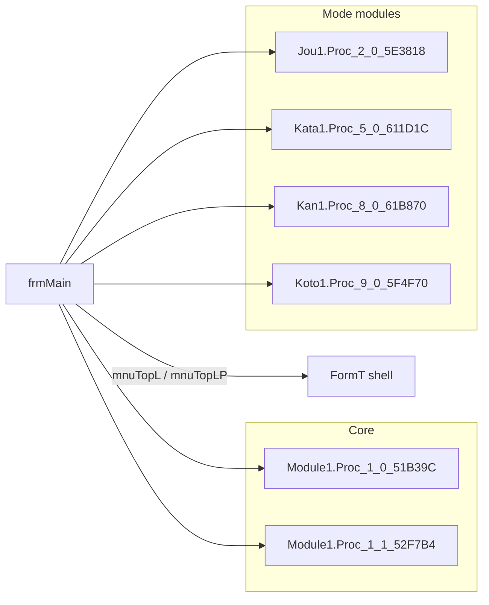

# Phase 2 — Call graph stub (manual)

## How to use

Add **directed edges** as you confirm them (source → target). Prefer **procedure addresses** from VB Decompiler (`'51B39C`) or symbol names if recovered.

## Seed edges (hypothesis / partial)

| From | To | Evidence | Confidence |
|------|-----|-----------|------------|
| `frmMain.mnuSougou_Click` | `frmSougou` `.Show` | `frmMain.frm` `506B40` | high |
| `frmMain.mnuSougouP_Click` | `frmSougou` `.Show` | `50EE48` | high |
| `frmMain.mnuRenshuu_Click` | `frmNigate` `.Show` | `50A1C4` | high |
| `frmMain.mnuRenJisseki_Click` / `mnuRenJissekiP_Click` | `frmRireki` `.Show` | `50979C`, `50FEAC` | high |
| `frmMain.mnuFontSettei_Click` | `frmSetting` `.Show` | `5096AC` | high |
| `frmMain.mnuIndicator_Click` | `frmIndicator` `.Show` | `506A20` | high |
| `frmMain.mnuKeikaTime_Click` | `frmKeikaTime` `.Show` | `506990` | high |
| `frmMain.mnuZenkoku_Click` | `frmWebrkg` `.Show` | `50B1A0` | high |
| `frmMain.mnuGuid_Click` | `KeyGuid` `.Show` (open branch) | `50A5AC` | high |
| `frmMain.mnuTopL_Click` / `mnuTopLP_Click` | `FormT` `.Show` | `50991C`, `510810` | high |
| `frmMain.mnuRom_Click` | `frmRomeBetu` `.Show` | `509724` | high |
| `frmMain.mnuKidou_Click` / `mnuZenrireki_Click` | `frmKidou` / `frmAllRireki` `.Show` | `50B264`, `50B328` | high |
| `frmMain.Timer1_Timer` | `frmKeikoku` `.Show` | `517378` body | med (conditional) |
| `frmMain` (many `mnu*P` / filter IDs) | `FormD` `.Show` | e.g. `mnuKako10P_Click` `5109F8` | med (pattern) |
| `frmMain.mnuReadMe_Click` | OS **`ShellExecute`** on `ReadMe.txt` | `50CECC` | high |
| `frmMain.mnuWeb_Click` | OS **`ShellExecute`** on `http://www.twfan.com/` | `509ECC` | high |

（TwFan 閉鎖後の Web 再現では、**非公式ミラー** `http://tanon710.s500.xrea.com/typewell_mirror/index.html` を開く。）

## Next steps

1. Add **mode start** edges (`Call Proc_0_131_557108`, `FormT` → `Jou*` / `Kata*`, …) once a single trial path is traced end-to-end.  
2. After Phase 6, inject **dynamic stack** or breakpoint hits as evidence columns.
