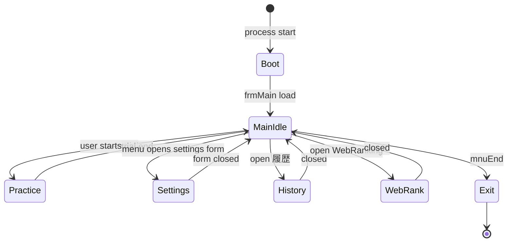

# Phase 5 — UI state machine (draft)

## Actors

- **Shell:** `frmMain` (primary), `FormT` (secondary shell — relationship TBD).
- **Settings family:** `frmSetting`, `frmIndicator`, `frmMiss`, `frmNigaSettei`, `frmKeikaTime`, `frmRomeBetu`, `KeyGuid`.
- **Data / history:** `frmRireki`, `frmAllRireki`, `frmSougou`, `frmNigate`, `frmCopyOK`, `FormSoufu`, `frmKidou`.
- **Web / misc:** `frmWebrkg`, `frmReference`, `frmHeavy`, `frmLoad`, `frmDialog`, `frmDialog2`, `frmKeikoku`, `FormD`.

## Draft state diagram

## Timer hypothesis

`frmMain` contains **3** `VB.Timer` controls — likely:

1. **Global clock / trial elapsed**  
2. **Blink / cursor**  
3. **Idle or auto-save**

**Next:** Record each Timer’s `Name`, `Enabled`, `Interval` from the form header block and map `Timer1_Timer` (`517378`) body to state transitions. **Wave 3:** wall-clock vs `Timer1` interval not measured — defer to [06-dynamic-notes](06-dynamic-notes.md) “Suggested first experiments” / future **EXP-TIMER** if needed.

## Menu → form mapping

Evidence: `frmMain.frm` pcode (`twjrdecomp/frmMain.frm`) — each row is a **`Private Sub mnu…_Click`** that ends in **`SomeForm.Show`** (modal style `1` passed via stacked args) unless noted.

| Menu handler | Target / action | Evidence (handler VA) |
|--------------|-----------------|------------------------|
| `mnuSougou_Click` | `frmSougou.Show` | `506B40` |
| `mnuSougouP_Click` | `frmSougou.Show` (positions near main form first) | `50EE48` |
| `mnuNigateSettei_Click` | `frmNigaSettei.Show` | `506A68` |
| `mnuMissJougen_Click` | `frmMiss.Show` | `5069D8` |
| `mnuRenshuu_Click` | `frmNigate.Show` | `50A1C4` |
| `mnuRenJisseki_Click` | `frmRireki.Show` | `50979C` |
| `mnuRenJissekiP_Click` | `frmRireki.Show` (clamps position to screen) | `50FEAC` |
| `mnuMail_Click` | `FormSoufu.Show` | `506AF8` |
| `mnuFontSettei_Click` | `frmSetting.Show` | `5096AC` |
| `mnuIndicator_Click` | `frmIndicator.Show` | `506A20` |
| `mnuKeikaTime_Click` | `frmKeikaTime.Show` | `506990` |
| `mnuZenkoku_Click` | `frmWebrkg.Show` | `50B1A0` |
| `mnuGuid_Click` | `KeyGuid.Show` **or** `Global.Unload` on existing guide (toggle) | `50A5AC` |
| `mnuTopL_Click` | `FormT.Show` | `50991C` |
| `mnuTopLP_Click` | `FormT.Show` (also adjusts height vs screen) | `510810` |
| `mnuRom_Click` | `frmRomeBetu.Show` | `509724` |
| `mnuKidou_Click` | `frmKidou.Show` | `50B264` |
| `mnuZenrireki_Click` | `frmAllRireki.Show` | `50B328` |

### Menus that do **not** open a dedicated tool form

| Handler | Behavior |
|---------|----------|
| `mnuReadMe_Click` | Opens `\ReadMe.txt` under `App.Path` via **`ShellExecute`** (or `MsgBox` if missing). |
| `mnuWeb_Click` | **`ShellExecute`** on URL **`http://www.twfan.com/`** — delegates to default browser. （Web 再現: TwFan 閉鎖のため **非公式ミラー** `http://tanon710.s500.xrea.com/typewell_mirror/index.html`。） |
| `mnuEnd_Click` / `mnuEndb_Click` | **`Global.Unload Me`** — exit shell. |

### Many ranking / filter / “print” items → `FormD`

A large family of `mnu*` / `mnu*P` handlers (e.g. `mnuKako10P_Click` at `5109F8`, `mnuBestP_Click` at `510FB0`, …) follows the same pattern: position `FormD` from `MemVar_630174` then **`FormD.Show`**. Treat **`FormD`** as the **shared chart / ranking dialog** surface for those menu IDs (exact title per menu still TBD).

### Timer-driven UI (not menu)

`Timer1_Timer` (`517378`) updates elapsed caption and, under some mode checks, prepares **`frmKeikoku`** text and calls **`frmKeikoku.Show`** — see pcode around `517058`–`517370` in the same `frmMain.frm` export.
