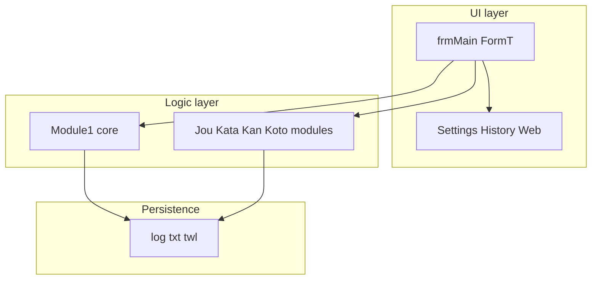

# Phase 7 — Consolidated system view

## One-paragraph summary

`TWellJR.exe` is a **32-bit VB6 GUI application** (project version **2.23**) whose structure is captured in the VB Decompiler export [`twjrdecomp/`](../../twjrdecomp/). The program centers on **`frmMain`**: a menu-driven shell with **timers** and mode-specific logic split across **`Jou*` / `Kata*` / `Kan*` / `Koto*`** standard modules. Shared **time→level** mapping lives in **`Module1.Proc_1_0_51B39C`** with explicit **206-second** cutoff for the out-of-chart dash. Peripheral features manage **logs** (`Time*.log`, `Dtld*.log`, `Bptn*.log`, `Poor*.log`, …), **settings forms**, **history**, and **web ranking**.

## Architecture diagram

## Resolved (bootstrap pass)

| ID | Topic | Where documented |
|----|-------|------------------|
| R-01 | Component inventory | [02-component-map](02-component-map.md) |
| R-02 | `frmMain` menu/timer bootstrap | [02-frmMain-survey](02-frmMain-survey.md) |
| R-03 | Log filename patterns | [03-io-contracts](03-io-contracts.md) |
| R-04 | Time→level ladder + 206s | [04-domain-typing](04-domain-typing.md) |

## Resolved (Wave 2 — 2026-04-17)

| ID | Topic | Evidence |
|----|-------|----------|
| O-01 | SHA-256 + file size + PE headers | [00-governance](00-governance.md) table; [01-binary-triage](01-binary-triage.md) Observed column; `dumpbin /HEADERS` |
| O-02 | P-code vs Native | [01-binary-triage](01-binary-triage.md) — `CompilationType=1` + PE triage |
| O-03 | `.frx` presence | [01-binary-triage](01-binary-triage.md) — recursive `*.frx` search under install root (**none**) |
| O-04 | `Proc_1_0` font branch `0x4C` | [04-domain-typing](04-domain-typing.md) — CP932 decode of mojibake literals |
| O-05 | `Proc_1_1_52F7B4` full key map | [04-domain-typing](04-domain-typing.md) table |
| O-06 | `Jou1` / `Jou2` / `Jou3` diff | [04-mode-module-diff](04-mode-module-diff.md) |
| O-07 | Call graph seed edges | [02-callgraph-stub](02-callgraph-stub.md) |
| O-08 | Menu → `Show` / `ShellExecute` | [05-ui-statechart](05-ui-statechart.md) |
| O-09 | Network (static IAT + documented `ShellExecute`) | [06-dynamic-notes](06-dynamic-notes.md#exp-20260417-pe), [03-io-contracts](03-io-contracts.md) |

## Resolved (Wave 3 — 2026-04-17)

| ID | Topic | Evidence |
|----|-------|----------|
| O-10 | `frmWebrkg` / WebRanking network surface | [06-dynamic-notes — EXP-20260417-WEB](06-dynamic-notes.md#exp-20260417-web) (export + EXE scan; API Monitor optional) |
| O-11 | `Proc_1_0` ladder / font branch check | [06-dynamic-notes — EXP-20260417-LEVEL](06-dynamic-notes.md#exp-20260417-level) (pcode walk; live debugger optional) |

## Open backlog (prioritized)

| P | ID | Item | Next action |
|---|-----|------|----------------|
| P5 | O-12 | `.frx` companion files | None under `TWJR216`, Dropbox root, `dev\type`, or `Documents` ([EXP-20260417-WAVE3-FRX](06-dynamic-notes.md#exp-20260417-wave3-frx)); recover from original media / VB6 project if found, then copy beside `twjrdecomp/*.frm` |
| P6 | O-13 | Live API Monitor (optional hardening) | Attach during `frmWebrkg` use — filter `wininet` / `CreateFileW` to bolster EXP-WEB |
| P6 | O-14 | x32dbg on `51B39C` (optional) | Image-relative break + register dump for one `arg_C` if QA requires CPU proof |

## Maintenance

When any **O-** item closes, move row to **Resolved** with link to evidence in [06-dynamic-notes](06-dynamic-notes.md) or the relevant phase doc.
