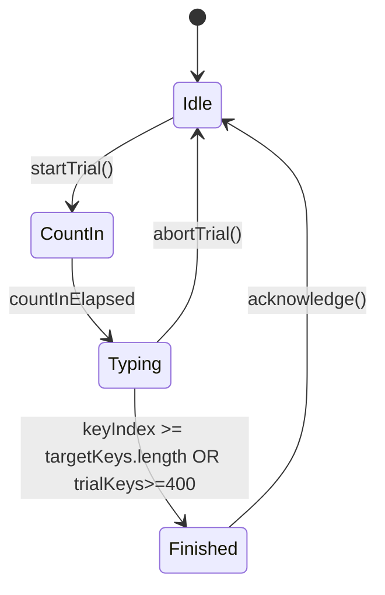

# Game engine — pseudocode and state machine

Language-agnostic core for a **400-keystroke trial** (国語Ｒ-style). React/Canvas only calls into this layer.

## State variables

```text
TrialState:
  mode: enum { kihon, katakana, kanji, kanyoku }
  targetKeys: string              // full romaji for current 400-key segment (concatenated words)
  keyIndex: int                   // 0 .. targetKeys.length
  keystrokesRemaining: int        // counts down from 400 for "trial progress" (or use keyIndex cap)
  startedAtMs: int | null
  lastKeyAtMs: int | null
  totalCorrectKeys: int
  recentIntervalsMs: ring buffer  // last K key-to-key intervals for pace / goal color
  rngSeed: uint32                 // deterministic replays in tests
  words: WordEntry[]              // sequence shown this trial
```

```text
WordEntry:
  surface: string    // Japanese display
  reading: string    // expected romaji (Hepburn-style for MVP)
```

## State machine (high level)



## Level computation

Input: `totalSeconds` for the completed trial (wall or active typing—MVP uses **active typing sum** optional flag).

Output: `levelId: string | null` per `levels.md`.

Pseudocode:

```pseudo
function levelFromTotalSeconds(t):
  if t >= 206: return null
  if t >= 76: return subdivide(t, range=[76,206), labels=[J..A])
  if t >= 56: return subdivide(t, range=[56,76), labels=[SJ..SA])
  if t >= 36: return subdivide(t, range=[36,56), labels=[SS..XB])
  return subdivide(t, range=[0,36), labels=[XA,XS,XX,ZJ,ZI,ZH,ZG])
```

`subdivide` assigns the slowest label to times near the **upper** bound of the range (slower is worse).

## Goal / pace indicator (ReadMe semantics)

ReadMe: blue = faster than goal, yellow/red = slower.

Pseudocode:

```pseudo
targetSeconds = levelToTargetSeconds(goalLevel)  // user picks goal; default J
paceEwmaMs = exponentialMovingAverage(recentIntervalsMs)

if paceEwmaMs < secondsToEwmaThreshold(targetSeconds):
  color = blue
else if paceEwmaMs < 1.15 * threshold:
  color = yellow
else:
  color = red
```

Constants (`1.15`, EMA alpha) are **tunable**; replace when EXE formulas are known.

## Word selection

```pseudo
function pickNextWord(mode, dictionary[mode], rng):
  repeat:
    w = dictionary[mode][rng.nextInt(dictionary[mode].length)]
  until w not in lastNWords  // avoid immediate repeats
  return w
```

Concatenate readings until `sum(reading.length)` reaches **400** (or pad final word—product rule should match original; mark TODO in code).

## Input handling

```pseudo
onKeyDown(key):
  if key is Backspace:
    apply backspace policy (optional miss limit)
  expected = targetKeys[keyIndex]
  if normalize(key) == normalize(expected):
    record interval; advance keyIndex; play correct SE flag
  else:
    record miss; optional loss time
```

Normalization: case-insensitive ASCII; future: shift-JIS path only in data layer, not here.

## Outputs for render layer

```pseudo
getRenderState():
  currentWordIndex, caretInWord
  surfaceGlyphs[] with highlight index
  romanGuide: string  // substring of reading aligned to current word; empty if UI disables
  progress01: float
  indicatorColor: blue | yellow | red | neutral
```

Roman guide default **ON** (per project plan).
